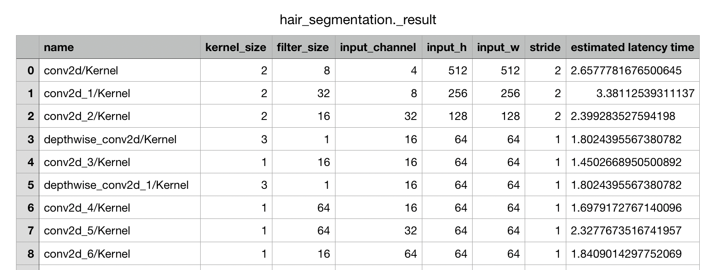

# TFLite Latency Estimator

This is one of [Mediapipe](https://google.github.io/mediapipe/) opensource project from [Google Summer of Code](https://summerofcode.withgoogle.com/). 


It is about latency estimator which is able to get each of convolution layer's estimated latency time. 

<br/>


## 1. How to use

#### install packages
```bash
pip install -r requirements.txt
```

#### run tflite latency estimator
```bash
python -m estimator.py --path {TFLITE_MODEL_PATH}
```

#### result



<br/>

## 2. Model Information

This estimation model uses 3 kind of regression model and ensembled them. 

- [XGBoost](https://xgboost.readthedocs.io/en/latest/)
- (Scikitlearn) RandomForestRegressor
- (Scikitlearn) DecisionTreeRegressor

<br/>

## 3. Data used for learning

Combinations of below's list

- kernel : [1, 2, 3, 5]
- filter : [16, 32, 64, 128, 256]
- input_h : [8, 16, 32, 64]
- input_w : [8, 16, 32, 64]
- input_channel : [16, 32, 48]
- stride : [1, 2, 3]

And also got one convolution models from real DCNN models.

- Densenet, MobileNet from [tflite model zoo](https://www.tensorflow.org/lite/guide/hosted_models?hl=ko)
- [face_detection](https://github.com/google/mediapipe/blob/master/mediapipe/modules/face_detection/face_detection_short_range.tflite)
- [hair_segmentation](https://github.com/google/mediapipe/blob/master/mediapipe/models/hair_segmentation.tflite)

<br/>

## Etc.

- Mobile Device used to measure latency : Galaxy s6